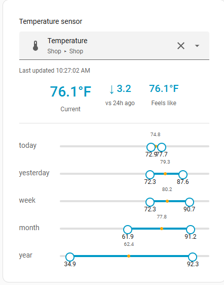

# Highs & Lows Card

*Created by Papa Lanc and his buddy Claude*

A Home Assistant Lovelace card that shows min / max / mean temperature history
for **today, yesterday, week, month, and year** as compact range bars, plus
the current reading and the change vs. 24 hours ago.



## Features

- Range bars for today / yesterday / week / month / year, each showing min,
  mean, and max
- Current reading and delta vs. this time yesterday
- **Feels Like**: if the selected temperature sensor has a paired humidity
  sensor on the same device — like a DHT11/DHT22, AM2302, or any other
  combined temp+humidity probe — the card automatically finds it and shows a
  heat-index "Feels Like" value alongside the current temperature. No extra
  configuration needed; it's detected via the entity's device in the HA
  registry.
- Runs natively in the HA frontend: no CORS setup, no long-lived access
  token, no external hosting. It uses the same authenticated connection the
  rest of your dashboard uses.

## Installation

### Via HACS (custom repository)

1. HACS → ⋮ (top right) → **Custom repositories**
2. Add `https://github.com/Grey-Lancaster/highs-lows-card`, category **Dashboard**
3. Close the dialog, then use HACS's search bar to search **"Lancaster"** (or "Highs & Lows") to find the card in the list
4. Click the ⋮ next to it → **Download**
5. Home Assistant will auto-register the resource for you

### Manual

1. Copy `highs-lows-card.js` into `/config/www/`
2. Settings → Dashboards → ⋮ → **Resources** → Add Resource
   - URL: `/local/highs-lows-card.js`
   - Type: JavaScript Module

## Usage

### Auto-discover mode (recommended)

Omit `entities` and the card scans your instance for every sensor with
`device_class: temperature`, and gives you Home Assistant's own entity
picker (search box, icons, device/area context) to switch between them.
Disabled, hidden, and diagnostic entities (e.g. internal chip temperature
sensors) are excluded automatically.

```yaml
type: custom:highs-lows-card
title: Temperature Sensors
```

### Manual/curated mode

List specific sensors, with optional display names and an explicit humidity
pairing if you want to control the Feels Like source yourself rather than
relying on auto-detection:

```yaml
type: custom:highs-lows-card
title: Shop & sensors
entities:
  - entity: sensor.shop_temperature
    name: Shop
    humidity_entity: sensor.shop_humidity
  - entity: sensor.big_room_temperature
    name: Big room
default_entity: sensor.shop_temperature   # optional, defaults to first in list
```

### Options

| Option             | Type   | Default   | Description                                             |
|--------------------|--------|-----------|-----------------------------------------------------------|
| `title`            | string | —         | Card header                                                |
| `entities`         | list   | auto-discover | Curated list of `{ entity, name?, humidity_entity? }`  |
| `default_entity`   | string | first in list | Entity selected on load (manual mode)                 |
| `refresh_interval` | number | `300`     | Seconds between history refreshes                          |

## License

MIT — see [LICENSE](LICENSE).
